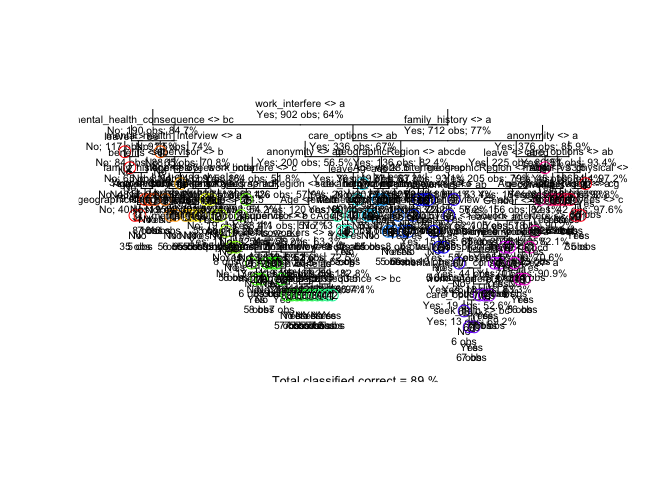
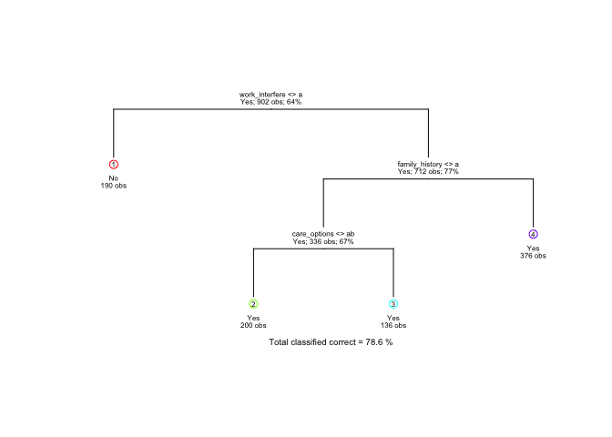
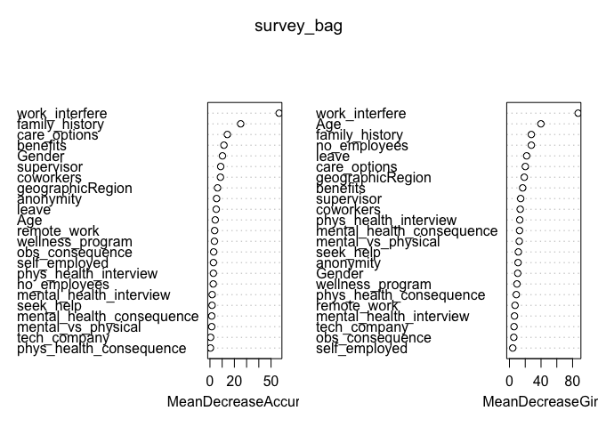
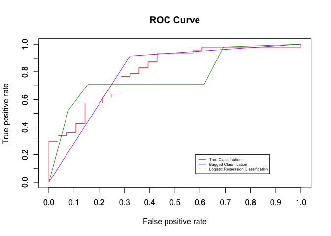

# Mental Health in Tech

*Vivian Tran and Nicolle Yaranga*

*University of California, Santa Barbara*

*Fall 2017*

## 1. Abstract


This data mining project looks at the several statistical models and their ability to predict whether or not an individual will seek treatment for a mental health condition. We use the data from a Open Sourcing Mental Illness's 2014 survey, which includes employee-reported information about their companies, specifically data regarding the companys' and employees' attitudes towards mental health. Using the classification tree, bootstrap aggregating ("bagging"), and logistic regression models, we note differences in accuracy (and thus, effectiveness), the models has toward the entire data set. We conclude that the logistic regression model and the bootstrap aggregate model were both effective in classifying Although we used models to predict our outcome, we noticed similar reapearing patterns that we knew would serve of importance when predicting indivduals attitude toward mental health treatment.

## 2. Introduction


Our goal is to build a model that can predict whether or not an employee seeks treatment for a mental health condition. Specifically, we would like to focus on the factors that influence whether or not an individual would seek professional help. There have been many studies (implementing data mining) done on the effects of mental health, for example, Joachim Diederich's *Ex-ray: Data mining and mental health*: "\[m\]achine learning techniques such as support vector machines are applied to a text classification task to determine mental health problems" (Diederich, 2006). However, little to no studies have focused specifically on the effects of mental health in a "tech" workplace.

Many assumptions can be made when comparing workplaces that revolve around technology and software engineering to non technology workplaces, but it can be firmly stated that mental health continues to be a problem less addressed in all workplaces. By looking at individuals attitude toward mental health when they are in the workplace, we get a new set of opinions that help us determine they're overall commitment to seeking mental health treatment. This is important because as people graduate college and look for jobs in the "real world", a fair amount of them will be diving into the tech industry. Thus, mental health is an imperative topic that employers must address.

The data is found on Open Sourcing Mental Illness's website, a non profit dedicated to raising awareness on mentall well-being in the tech community. The organization holds an annual survey open to the public, and we focus on the data from 2014. This could impact our methods because it could mean that people taking the survey are more inclinded to take interest in mental wellness. Instead of taking a random large sample from a random group of individuals, the survey is directed towards people viewing the website and taking an interst in the subject before even knowing the issue addressed. Nonetheless, this data serves perfectly in our research because it inquires peoples' opinions of work-related matters, matters that may influence their mental wellbeing.

Our analysis is performed using the R statistical programming language. We first split the data set into training and test sets. We then focused on classification techniques, which include comparing the error after fitting the models on the test set. The models we chose to perform are a decision tree, bootstrap aggregated trees, and logistic regression. Through the ROC curve, which shows the relationship between false-positive rate and true-positive rate of a model, and the area under those curves, we concluded that the logistic regression model was was the best model for classifying whether or not a person chose to seek treatment for a mental health issue. This model, however, was followed closely by the bootstrap aggregate decision tree model. Overall, we were successful in our attempt to find a model that would classify those who chose to seek treatment against those who did not choose to seek treatment.

## 3. Data and Methods


### Data Cleaning

Tidy data is essential for reproducibility and interpretability for future research. Thus, the first step in our analysis is to clean our data set. Since the survey included some open-response questions, many of the outcomes were different but belonged to the same group-- for example, gender. We created three groups for gender- male, female and other.

To simplify the data even further, we group countries by regions to create a more concise classification and to create a more even distribution of regional groups. The regions were "US" "NorthAmerica\_other" (North American countries that are not the US), "Asia", "Europe", "Africa", "Oceana" (Australia and New Zealand), and "South\_Central\_America" (Countries located in South and Central America). We renamed the "Country" column to "geographicRegion". Our predictor variable is "treatment" which corresponds to the question "Have you sought treatment for a mental health condition?" (OSMI, 2014). We remove variables that were not as relevant or important indicators of seeking mental health treatment. These variables include Timestamp (all of the observations were recorded in the data set around the same time), comments (they are much too open-ended to be used to classify individuals), and state (this is redundant because we already have the US listed as a geographic region).

### Methods

Since treatment is a categorical variable with levels being "Yes" and "No", we use classification techniques to build our models: tree() (classification tree), randomForest() (bootstrap aggregated trees), and glm() (logistic regression).

### Test and Training Set

We randomly sample 100 observations from the data set to create our training set. The remaining observations make up our test set. We made sure to use the set.seed() function in order to make the sampling reproducible. If we did not use set.seed(), the 100 samples would not be consistent every time we run the code. Throughout our analysis, we fit our models to the training set and then fit the models to the test set to see how well the models are able to classify individuals.

``` r
set.seed(1)
surv.indices <- sample(1:nrow(survey2), 100)
survey_train <- survey2[-surv.indices,]
survey_test <- survey2[surv.indices,]
```

### Decision Tree


The first model we fit to our training data is a decision tree using the tree() function, where we specify method="class" to obtain a classification tree. We decided to use this model because our variables had mostly binary, categorical responses. First, we created our tree parameters with minsize=10 and mindev= 1e-3. Then we fit a tree model to predict treatment in our training set. Using the summary() function, we are able to see that the model has 92 terminal nodes and a misclassification error rate of 0.1098. A small 399.4/810 observations are missclassified. However, we want a simpler model because 89 nodes is fairly large, and large decision trees tend to overfit and result in high variance. Additionally, such a large tree is impractical for visualization.

    ## 
    ## Classification tree:
    ## tree(formula = treatment ~ ., data = survey_train, control = tree_parameter)
    ## Variables actually used in tree construction:
    ##  [1] "work_interfere"            "mental_health_consequence"
    ##  [3] "leave"                     "benefits"                 
    ##  [5] "family_history"            "Age"                      
    ##  [7] "geographicRegion"          "supervisor"               
    ##  [9] "mental_health_interview"   "no_employees"             
    ## [11] "care_options"              "anonymity"                
    ## [13] "phys_health_interview"     "coworkers"                
    ## [15] "seek_help"                 "remote_work"              
    ## [17] "wellness_program"          "tech_company"             
    ## [19] "mental_vs_physical"        "Gender"                   
    ## Number of terminal nodes:  92 
    ## Residual mean deviance:  0.4931 = 399.4 / 810 
    ## Misclassification error rate: 0.1098 = 99 / 902



#### Prune the decision tree

We decided to do a 10-fold cross-validation with the funtion cv.tree(). To find the smallest yet best size for the tree, we must look at the smallest misclassification error of each fold. In the end, the best size was 4 nodes. Notice that the only three variables that were taken into consideration in the classification were work\_interfere, family\_history and care\_options which were the variables that the function decided to split on at the top nodes of the 92-node tree.

    ## [1] 4

Our new pruned tree had a missclassification error rate of 0.214. Although the error is larger by about 10%, it is still fairly small considering we only considered three variables. This shows that simple models can contain important variables that capture much of the information needed for classification.

    ## 
    ## Classification tree:
    ## snip.tree(tree = survey.tree, nodes = c(12L, 2L, 7L, 13L))
    ## Variables actually used in tree construction:
    ## [1] "work_interfere" "family_history" "care_options"  
    ## Number of terminal nodes:  4 
    ## Residual mean deviance:  0.9675 = 868.8 / 898 
    ## Misclassification error rate: 0.214 = 193 / 902



Finally, we fit our pruned tree to the test set using the predict() function and found the test error rate using the table() function. Our test error rate came out .37. From our confusion matrix, we make the following observations:

Out of 100 total individuals, our model classified 63 correctly, giving us a 69% classification rate (37% test error). Out of the 52 individuals who did not seek treatment, 25 were classified correctly, giving us a 30.76% classification rate for those who did not seek treatment. Out of 48 individuals who did seek treatment, 47 were classified correctly, giving us an 97.92% classification rate.

    ##          Actual
    ## Predicted No Yes
    ##       No  16   1
    ##       Yes 36  47

    ## [1] 0.37

Overall, our tree model seems to do an adequate job at determining whether or not an individual will seek treatment, but it could be better. As for the results of this model, because our test error rate was fairly low we can say with a fair amount of confidence that individuals will seek mental health treatment depending on whether they feel that their mental health condition interferes with work. However, the more interesting result is the use of variable "care\_options", which states if a person knows the options for mental health care provided by his/her employer. We predict that IF an employee knows about the resources provided to them, then they are more likely to seek treatment for mental health. This is important, because companies can use this information as an motive to provide their employees with more opportunities to work on mental health, such as company paid therapy, workshops, vacation time, etc. Tech and non tech companies need to put their employees first and not forget the importance of their mental well-being.

### Bootstrap Aggregate


Since our classification rate for the tree model could have been better, we fit the training data using bootstrap aggregated tree models (also known as "bagging") using the randomForest() function. The function would not run initially because our data set contains NA values, so we specified the function to omit the NA values. There are 500 trees and the number of variables treid at each split is four.

    ## 
    ## Call:
    ##  randomForest(formula = treatment ~ ., data = survey_train, importance = T,      na.action = na.omit) 
    ##                Type of random forest: classification
    ##                      Number of trees: 500
    ## No. of variables tried at each split: 4
    ## 
    ##         OOB estimate of  error rate: 21.29%
    ## Confusion matrix:
    ##      No Yes class.error
    ## No  188 137  0.42153846
    ## Yes  55 522  0.09532062

Since we omited the NA values, predicting on the test set gives us 75 observations instead of 100. From the test set prediction, we make the following observations: Out of 75 total individuals, our model classifies 62 correctly, giving us an 82.67% classification rate. Out of the 28 individuals who did not seek treatment, 19 were classified correctly, giving us a 67.8% classification rate for those who did not seek treatment. Out of 47 individuals who did seek treatment, 43 were classified correctly, giving us an 91.49% classification rate.

With a test error of 17.33%, our bagged model classifies individuals much better than the optimally-pruned tree model. Additionally, this model performs better when classifying individuals who chose not to seek treatment for their mental health condition (82.67% correct vs 30.76% correct). This is because a tree models are sensitive to changes in the data (high variance). Using the bootstrap aggregate method takes the average of many trees in order create a more robust prediction.

    ##          Actual
    ## Predicted No Yes
    ##       No  19   4
    ##       Yes  9  43

    ## [1] 0.1733333

We can also observe which variables the bagged model determines as important through the model accuracy and Gini value. We can use these values to determine which variable to split on in order to decrease the "impurity" of our classification. In the plots below, we observe that removing the work\_interfere would cause the greatest decrease in model accuracy and the greatest decrease in the gini index. Thus, splitting on work\_interfere would increase the purity of our classification. It is worth noting that work\_interfere, family\_history, and care\_options are the top three variables in model accuracy plot, and they are also the variables that are chosen in our pruned decision tree.

``` r
varImpPlot(survey_bag, sort=T)
```



### Logistic Regression

The last model we are using to classify is the logistic regression model. We generate this model using the glm() function.

``` r
glm_survey = glm(treatment ~ ., data=survey_train, family="binomial")
```

    ##          Actual
    ## Predicted No Yes
    ##       No  17   6
    ##       Yes 11  41

    ## [1] 0.2266667

Fitting our model to the test set, we observed the following: Out of the 75 total individuals, our model classified 58 correctly, giving us a 77.33% classification rate and a test error of 22.66%. Out of the 28 individuals who did not seek treatment, 17 were classified correctly, giving us a 60.71% classification rate. Out of 47 individuals who did seek treatment, 41 were classified correctly, giving us an 87.23% classification rate.

Overall, our model performs better than the pruned tree model, but it does not perform as well as the bagged decision tree model. Again, those who did not seek treatment had a lower classification rate than those who did seek treatment.

## 4. Results

### Comparing the models

We compare all three models using ROC curves. To evaluate our classifiesrs using ROCR, we use the prediction function to convert the inputted data to a standardized format. We then measure the perfomance of each classifier using the function performance(). When we plot the performance of each model, we can clearly see that the tree classification underperforms compared to the Bagged classification and the logistic regression classification (we want as close as possible to a 1:1 relationship between the true positive rate and false positive rate). However, it is difficult to tell visually whether the logistic regression model is better or whether the bagged model is better because they both seem to hug the corner of our plot.



To have a more precise guage of the performance, we must calculate the areas under the ROC curves (AUC). Ideally, we want the area to be as close to 1 as possible. We observe that the area under the tree ROC curve is indeed smaller in value compared to the bagged and logistic regression models. From the AUC, we can see that the logistic regression model outperforms the bootstrap aggregate model. However, there is only a slight difference between the areas under the curves. According to the curves, both models are almost equal in perfomance.

``` r
#Calculating AUC for tree
auc_tree = performance(pred_tree, "auc")@y.values
auc_tree
```

    ## [[1]]
    ## [1] 0.7636218

``` r
#Calculating AUC for bagg
auc_bag = performance(pred_bag, "auc")@y.values
auc_bag
```

    ## [[1]]
    ## [1] 0.7967325

``` r
#AUC for glm
auc_glm = performance(pred_glm, "auc")@y.values
auc_glm
```

    ## [[1]]
    ## [1] 0.8054711

All other results, plots, and analyses are woven into the rest of the body of the report.

## 5. Discussion

We did achieve our goal of finding a model that will classify whether or not an individual will seek treatment for their mental health condition. With relatively low classification errors high areas under the curves, either a logistic regression model or a bootstrap aggregated model would be sufficient to classify the individuals. However, there were certainly some challenges that we encountered along the way.

One of the challenges that we encountered was choosing the model that would work with our data set. We initially tried to classify using K-Nearest Neighbors. However, most of the survey data was categorical, and the KNN() function did not handle data with type "factor" well. We tried to convert all of our categorical data points into numerical dummy variables and attempted to remove all rows with NA values, and all columns that contributed to the NA values, but we were not successful in getting the function to work. By removing so many observations, our data became very skewed with more individuals reporting that they did seek treatment. A data set such as this created very biased models, which resulted in very high false positive rates. Eventually, we went back to removing a minimal amount variables, and obtained more effective models.

In the future, we would attempt to improve on the bootstrap aggregate decision tree model using a random forest model. Since the bootstrap model was able to improve our pruned tree model drastically, we would be interested to see how much the random forest would improve the boostrap aggregate model and how the random forest model compares to the logistic regression model. We were surprised to see that the logistic regression model was on par in terms of performance with the bootstrap aggregate model. Thus, We would also want to improve upon the logistic regression model.

## 6. Miscellaneous


We obtained our data from Open Sourcing Mental Illness's website: <https://osmihelp.org/research/>. However, we were directed to this site from Kaggle: <https://www.kaggle.com/osmi/mental-health-in-tech-survey>

Here is a link to Deiderich's study on mental health using maching learning, as referenced in the introduction: <https://doi.org/10.1016/j.asoc.2006.04.007>
